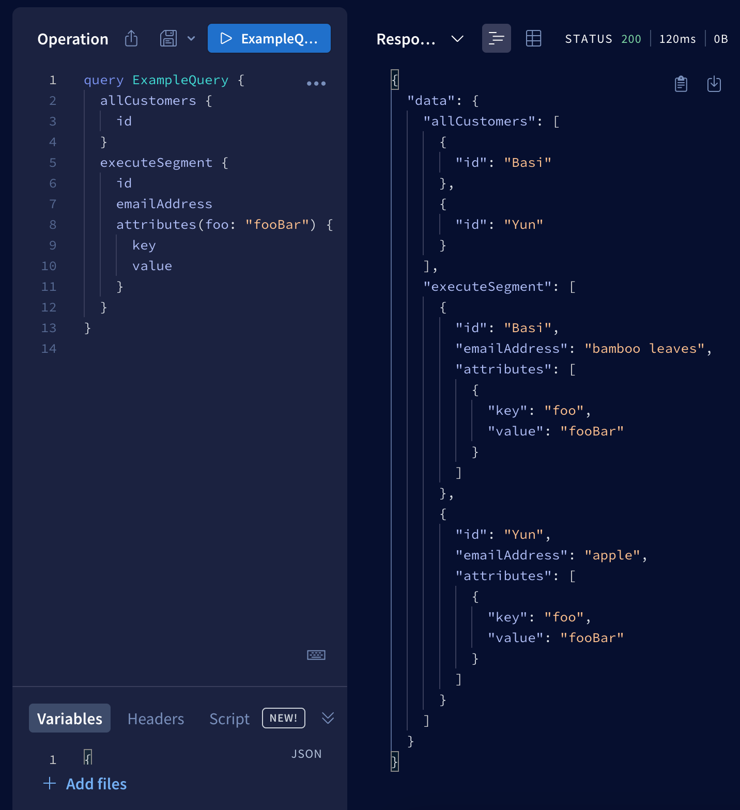

# Entities POC

## Requirements

* [Node v18](https://nodejs.org/en/download/releases)
* [Rover cli](https://www.apollographql.com/docs/rover/getting-started)

## Setup

Simply run `npm i`

## How to run it?

1. In two separate terminal windows execute `npm run start:api1` and `npm run start:api2`.
2. In two more separate terminal windows execute `npm run start:rover1` and `npm run start:rover1`.
3. Your supergraph should be available at `http://localhost:3000/`.

## Result

